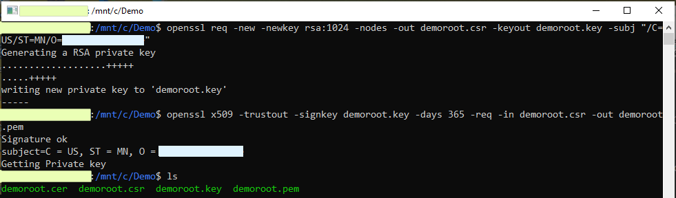
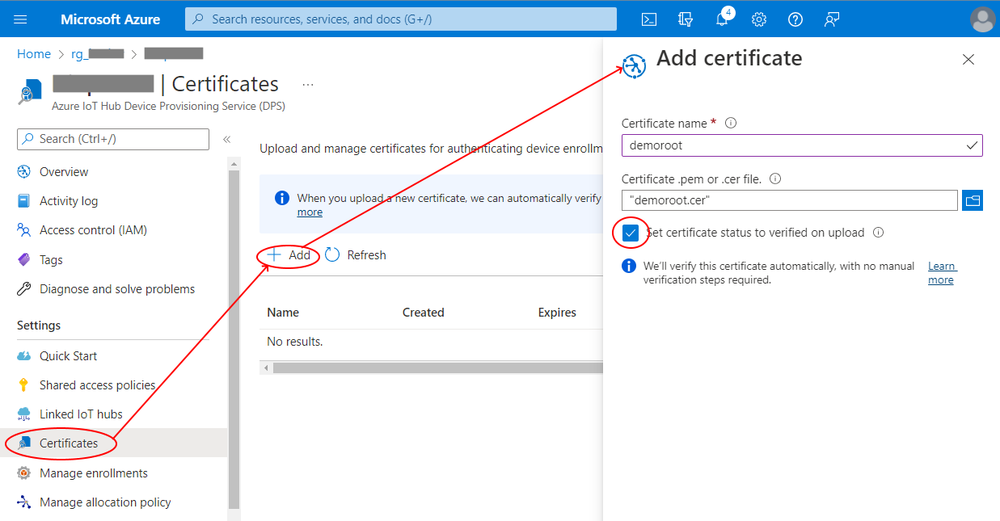
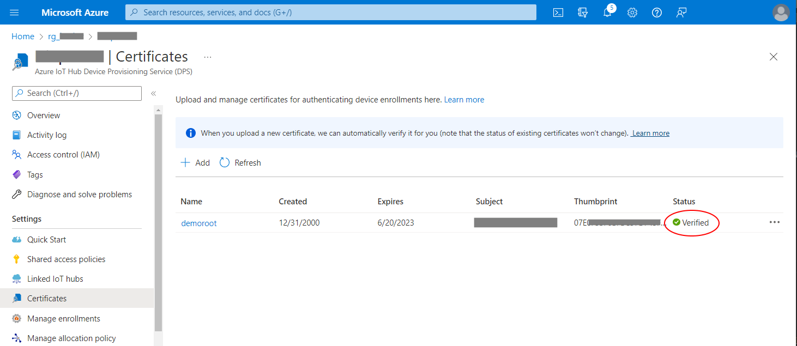
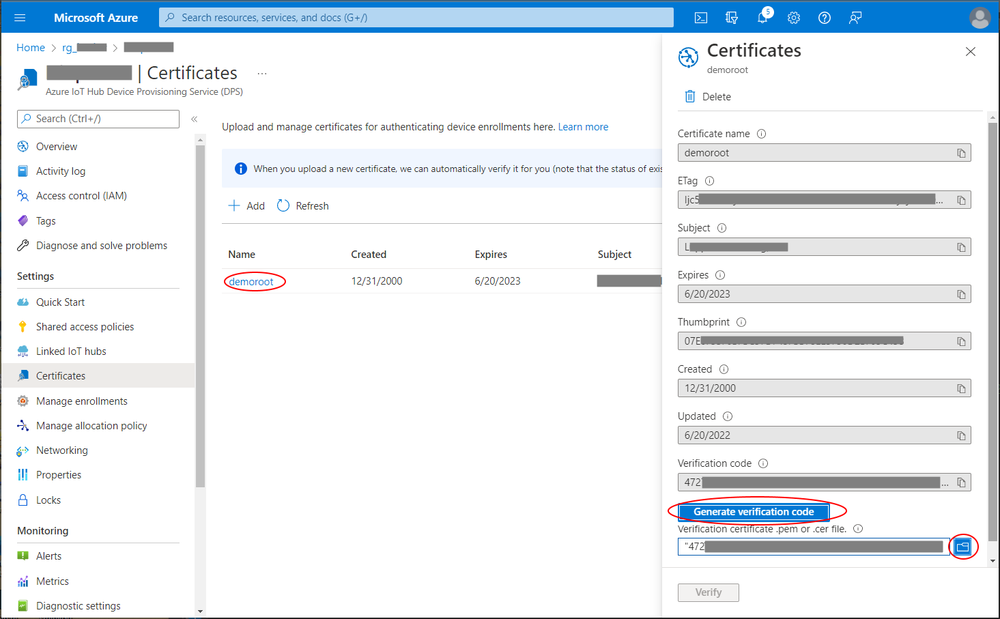
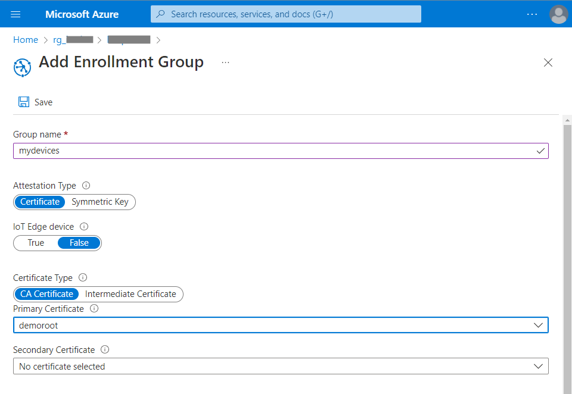
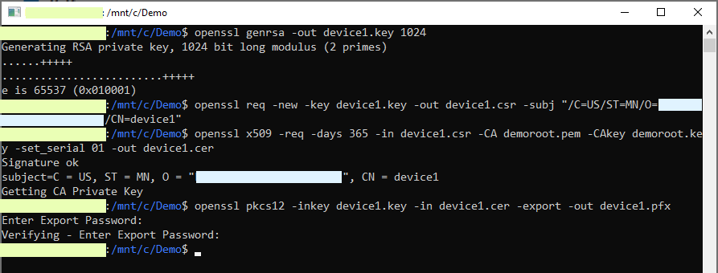

# Initializing Certificate Authentication in a DPS

This documents the process of creating, installing, and validating a root certificate in an Azure Device Provisioning Service, so that a device can authenticate to a DPS using only a certificate. This process involves several steps that need to be completed.

___
## Obtain or Create a CA root self-signed certificate:
If your company uses a CA service, follow their instructions to purchase or create a root certificate.

For testing purposes, it is possible to create a self-signed certificate using these commands: 

``` 
    openssl req -new -newkey rsa:1024 -nodes -out demoroot.csr -keyout demoroot.key -subj "/C=US/ST=MN/O=YourOrgName"
    openssl x509 -trustout -signkey demoroot.key -days 365 -req -in demoroot.csr -out demoroot.pem
    # View the contents of a cert
    openssl req -text -in demoroot.csr -noout -verify
```

        (Hint: Run OpenSSL on a Windows PC by opening a Bash command line on Windows by using the WSL service!)



___
___
## Install your Root Certificate in the DPS
To add the root certificate to the Azure Device Provisioning Service, go to the Settings - Certificates section of the DPS and Add a new certificate.



If select "Set Certificate status to verified" is selected, Azure will  assume that the person uploading the certificate owns it and will have access to the private key (which will be needed to create leaf certificates), and this ceremony is complete - skip ahead to the Create a Device Leaf Certificate section.




If the auto-verify option is not selected, the certificate will be unverified, and the uploader will have to prove they have access to the private key. To verify this certificate, click on the certificate name and then click on "Create Verification Code".



If using a CA service, create a verification certificate by creating a certificate with the common name equal to the verification code.

If using a self signed certificate, create a verification leaf certificate using these commands:

``` 
    openssl genrsa -out YourVerificationCode.key 1024
    openssl req -new -key YourVerificationCode.key -out YourVerificationCode.csr -subj "/C=US/ST=MN/O=YourOrgName/CN=YourVerificationCode"
    openssl x509 -req -days 365 -in YourVerificationCode.csr -CA demoroot.pem -CAkey demoroot.key -set_serial 01 -out YourVerificationCode.cer
``` 

Upload that certificate to the verification page, and your certificate status should go from unverified to verified.

___
___
## Create an Enrollment Group for this Certificate Chain
To allow devices to auto-enroll in this DPS using certificates from this chain, create an enrollment group. 
Select "Manage Enrollments" then click "Add enrollment group" to create a new group.
Set the Attestation Type to Certificate, then select the newly verified certificate as the Primary Certificate.



Once this group is registered, devices should be able to connect to the DPS using a certificate.

___
___
## Create a Device Leaf Certificate
To create a device certificate based on your leaf certificate, use these commands:

``` 
    openssl genrsa -out device1.key 1024
    openssl req -new -key device1.key -out device1.csr -subj "/C=US/ST=MN/O=YourOrgName/CN=device1"
    openssl x509 -req -days 365 -in device1.csr -CA demoroot.pem -CAkey demoroot.key -set_serial 01 -out device1.cer
    openssl pkcs12 -inkey device1.key -in device1.cer -export -out device1.pfx
``` 


___
___
## Using your device leaf certificate
Once the root certificate is installed, verified, and enrolled, a device can then present a leaf certificate to the Azure DPS and be authenticated and will be given credentials to use to connect to an assigned IoT Hub.

___
___
## For more information on OpenSSL and Certificate Generation, see:
https://www.digicert.com/kb/ssl-support/openssl-quick-reference-guide.htm
