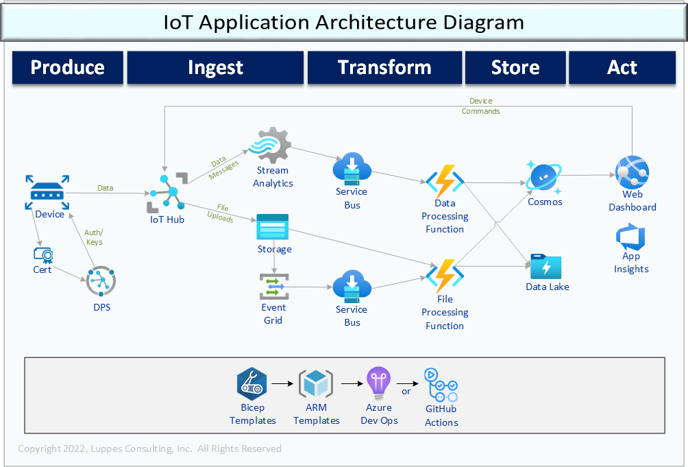

# Introduction 
This is a working example of deploying an IoT Application using Azure IoT PaaS components (not IoT Central).
This project has Bicep deploys for all sorts of objects that coordinate with each other to form this application.

# Getting Started
---

## 1. Before Deploy
1.1. Create AzDo environments listed in DeployToAzure/Environments folder. The YAML files are created with a DEV and QA environment, but that can easily be extended that to how ever many are needed.

1.2. Create variable groups as shown in DeployToAzure/VariableGroups and fill in with appropriate data (i.e. subscription info, desired app name, etc.). The Bicep files are designed to use a three character* Organization Code (or user initials), and a 6 character Application Name, forming standardized and unique names for each environment. 

    *Longer names can be specified, but some objects might exceed the max name length!

---
## 2. Deploy Azure Resources
2.1. Create an Azure Dev Ops job to run the Deploy_Infrastructure.yml YAML file to create the resources and execute the job, granting permissions as needed to the target subscription.

---
## 3. Post-Deploy
3.1. Create/purchase a root certificate for use in DPS and have the ability to create a leaf certificates for devices

3.2. Add tye certificate that was obtained to the DPS certificate store

3.3. Create a DPS enrollment group based on the certificate. 

    Note: these steps are still not available in ARM templates... maybe could do it in Powershell...? The certificate can be deployed in Bicep with auto-verification, but when the Bicep is run a second time it fails.

---
## 4. Deploy Applications
4.1. Deploy the Function App by creating a pipeline based on the Deploy-Function.yml.

4.2. Deploy the Dashboard Website by creating a pipeline based on Deploy-WebSite.yml.

4.3. Start the Function App, Website, and Stream Analytics

---
## 5. Start running the simulation
5.1. Build a Simulator EXE by creating a pipeline based on Deploy-Simulator.yml. That pipeline will create an artifact and optionally save it out to a storage folder

5.2. If using certificate authentication with the DPS, the DPS scope id will have to be updated in the config file.

5.3. Use the Simulator to stream data to the IoT Hub! 
